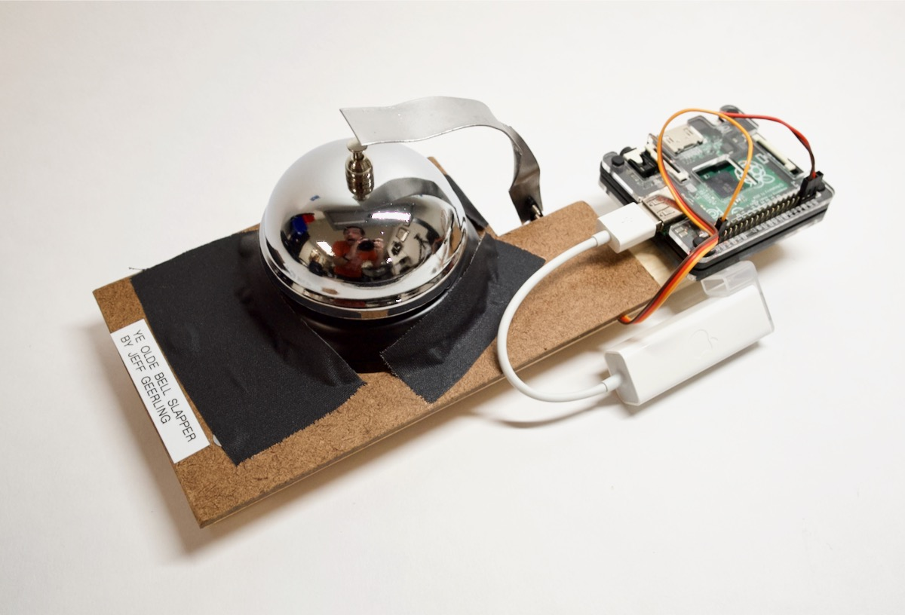

## Mark I - "Ye Olde Bell Slapper"

The original 2020 version of the notification bell was slapped using one of a pair of [MG90S Micro Servos](https://amzn.to/2I6sZSC) I bought from Amazon. The Pi tells the servo to go, the servo hits the bell with a little armature, and there you have it.

Well now, here's where it gets interesting. I thought I'd share all the code and tell you how it's done. That's why you're reading this, isn't it?

  1. Clone this repository to your Pi: `git clone -b 1.3.0 https://github.com/geerlingguy/pi-bell-slapper.git`
  1. Run `python3 -m pip install RPi.GPIO` to install required dependencies.
  1. Plug in the following wires on the servo motor (see illustration below):

     1. Red wire to 5V power (pin 4)
     1. Brown wire to ground (pin 6)
     1. Orange wire to GPIO 21 (pin 40)

  1. Change into this directory (`cd pi-bell-slapper`) and run the command `./bell_slap.py`.
  1. Wait a second, and you'll see the motor spin, then reverse back to its original position.

Here's an illustration of the servo connections:

> Note: The servo's wires come preinstalled into a 3-pin dupont female connector. You can use a tiny thing to pry up the release on the orange pin barrel connector, and slide that out. Then slide it into a separate 1-pin dupont female connector, and voila! You can then plug that orange wire directly into pin 40.

### But how do I mount this contraption to _actually_ slap a bell?

Well... it's a little more complicated because to slap a real bell, you have to mount the servo motor to something solid, build a little armature to slap the bell, mount the bell so it doesn't move when slapped.

You can see my franken-build up at the top of this README. It ain't pretty, but she's got it where it counts.
