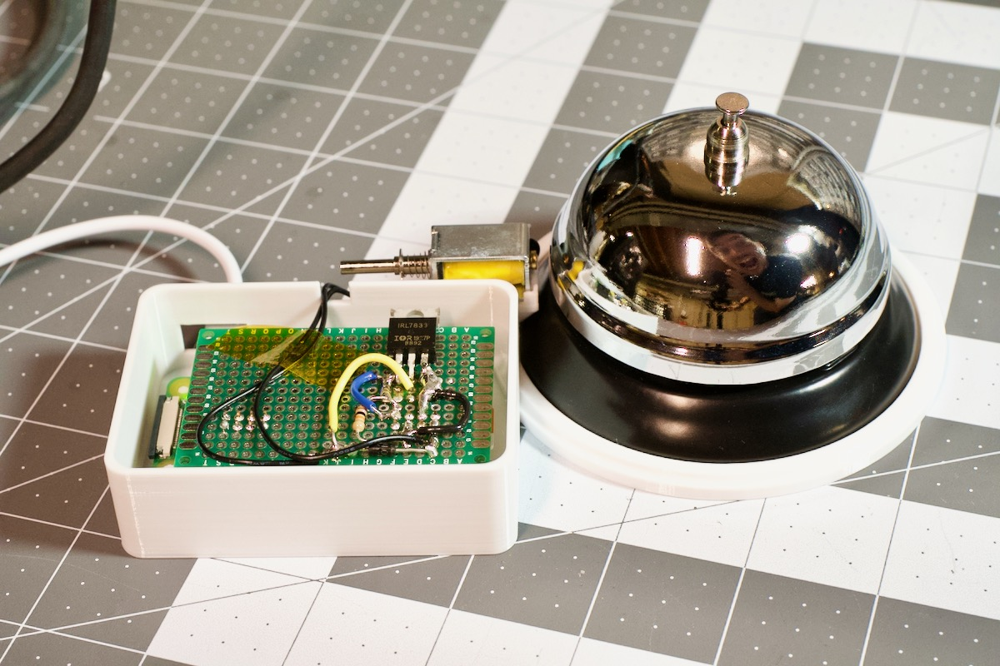
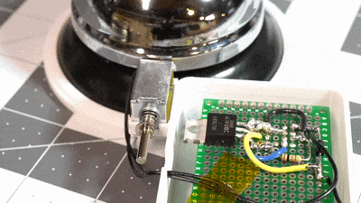
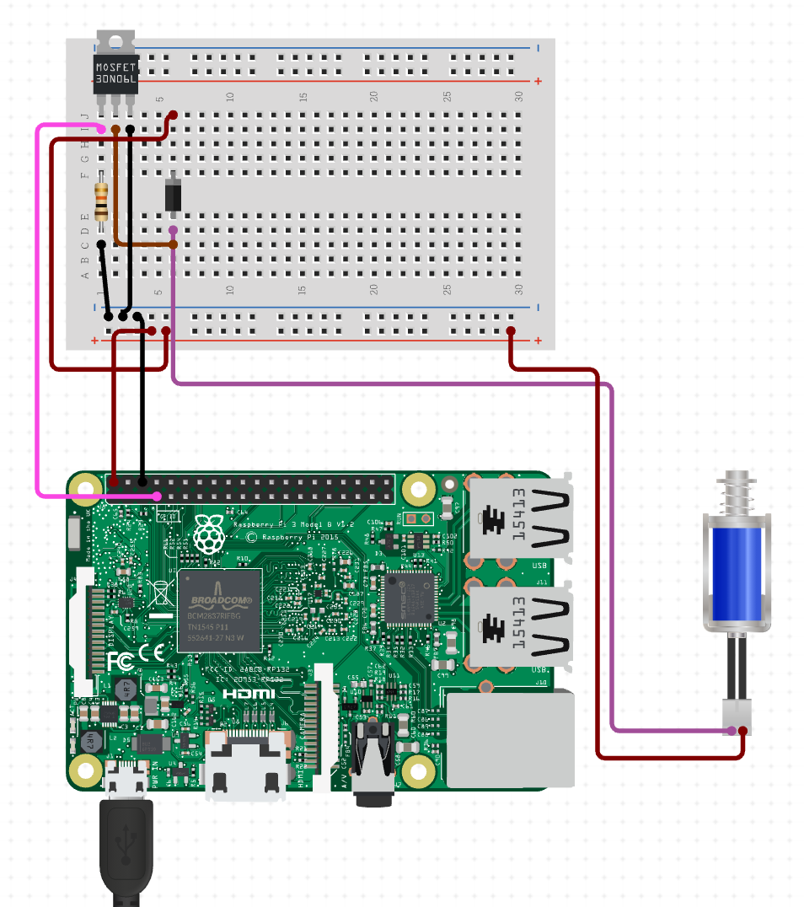

# Raspberry Pi Bell Slapper

_a.k.a. "The King of Ding", harbinger of the Internet of Dings_

[](https://github.com/geerlingguy/pi-bell-slapper/actions?query=workflow%3ACI)

<p align="center">
  
</p>

Why? I need a Raspberry Pi to slap a bell in response to a particular trigger.

In my case, it's for a radiothon. When a nonprofit community radio station gets a phone call, you can hear the phone in the background. When they get an online donation, you hear nothing.

Something is better than nothing, so I made this project, which slaps a bell upon a triggering condition.

## Is there a video of the build process?

Why, yes! How did you know?

Watch these videos for more on the build:

  - [The Raspberry Pi Internet of Dings Notification Bell](https://www.youtube.com/watch?v=o5wOzNzShrA) (June 2021 - "Clarence 2.0")
  - [The Raspberry Pi Bell Slapper - a software-controlled bell](https://www.youtube.com/watch?v=Etr7uIL9spg) (December 2020 - "Bell Slapper Mark I")

## How is the bell slapped?

I thought you'd never ask!

The bell is hit by a solenoid, specifically the [uxcell 4.5V mini Push-Pull Solenoid](https://amzn.to/2UkcLvh) I bought from Amazon.

<p align="center">
  
</p>

The Pi tells the solenoid to trigger, and a little circuit I built as a hacked-together Pi HAT fires off a short pulse of energy to hit the side of the bell directly.

> In 2020, the original "Mark I" version of the bell was slapped quite differently, using a servo. Read the [Mark I README](README-Mark-I.md) for more information about _that_ version of the bell.

## What kind of bell does it slap?

I'm currently slapping a boring old call bell. [This call bell](https://amzn.to/3iCUL5F). But any bell you could mount to be slapped would work.

## How do I slap a bell?

I'm glad you asked! You'll need to gather some parts and solder together a little control circuit, since the Pi can't drive a 1A solenoid directly through a GPIO pin.

### Parts Needed

  - [Raspberry Pi Zero W](https://www.raspberrypi.org/products/raspberry-pi-zero-w/)
  - [Micro USB Power adapter](https://amzn.to/3zGpCrL)
  - [5V Push-Pull Solenoid](https://amzn.to/3cYFxI2)
  - [Double-sided Prototyping board](https://amzn.to/3zTqrxE)
  - [IRL7833PBF MOSFET Transistor - 30V 150A](https://amzn.to/3iYr3Mj)
  - [1A 50V Diode](https://amzn.to/3wNcJtY)
  - 10K Ohm Resistor
  - [Electronics hook-up wire](https://amzn.to/3xEUxCS)
  - [2x4 8-pin female headers](https://amzn.to/3vLDa1O)

### Tools Needed

These are the tools I used to put everything together (though you can use any suitable substitute):

  - [Weller WES51 Soldering Station](https://amzn.to/3iUX6g8)
  - [Adjustable Circuit board holder](https://amzn.to/35CrgNo) (not necessary but helpful)
  - [Ender 3 v2 3D Printer](https://amzn.to/3xGxojo)

### Assembly

Check out [this circuit diagram on Circuito.io](https://www.circuito.io/app?components=9443,11015,200000):

<p align="center">
  
</p>

You could just stick everything into a breadboard like it's laid out in that diagram, but I decided to take a small protoboard and solder everything more permanently into a makeshift HAT that attaches to the top of the Pi Zero directly.

TODO: Add more detailed directions for wiring everything together—maybe also build a custom PCB?

## How do I contain this bell-slapping awesomeness?

I'm glad you asked. Over in the [`enclosure`](enclosure) directory, there are STL files for a case and lid. Print those on a 3D printer, mount everything inside, and you'll be good to go!

For the current design, I use friction and gravity to hold the Pi Zero and custom HAT in place, and superglue to hold in the solenoid.

The case design is derived from [@tenderlove's Analog Terminal Bell case](https://github.com/tenderlove/analog-terminal-bell/tree/master/case), and is modeled in OpenSCAD. The source files are also in the `enclosure` directory, should you like them.

## How do I tie email notifications to the bell slapper?

Well, now we're getting to the meat of it.

It's easy enough to slap a bell with your hand; there's no point in making a Raspberry Pi do it if you just want to slap the bell once or twice.

I built this project to monitor an email inbox. So I wrote a Python script, `email-check.py`. That python script does all the magic of translating "new email arrives" into "the bell has been resoundingly slapped".

To make this script work, you need to do two things on the Pi:

  1. Copy the `config.example.yml` file to a file named `config.yml`, and modify it with the email credentials for the account to be monitored.
  2. Make sure Pip is installed: `sudo apt install -y python3-pip`
  3. Run `python3 -m pip install imapclient pyyaml` to install required dependencies.

Then run `./email_check.py`, and prepare to be amazed! Or not, especially if it doesn't work.

> You might also need to install Pip, if you get an error on the `python3 -m pip` command. To do that, run `sudo apt install -y python3-pip`.

### How do I continuously check the email inbox?

Well now we're really getting somewhere useful!

For now, I'm just using cron. Fire up the ol' crontab editor (`crontab -l`) and add the following line:

```
* * * * * /home/pi/pi-bell-slapper/email_check.py
```

Then every minute the script will run!

> Note: If you have any errors, cron will email them to localhost (make sure you have something like `postfix` and `mailutils` installed to catch and read those emails). Other cron output goes into the syslog (check `/var/log/syslog`).

If you're using a Pi like the model A+, which doesn't have built-in WiFi, and you're using a cheap USB WiFi dongle to connect to the Internet, there's a chance it will go into a sleep mode after a minute or so—follow [these directions to stop the thing from sleeping](https://www.jeffgeerling.com/blogs/jeff-geerling/edimax-ew-7811un-tenda-w311mi-wifi-raspberry-pi).

## How do I also play a sound through a sound output?

The bell slapper can also play a sound when the bell is slapped, so you could have any other sound triggered upon a successful notification as well.

To enable this functionality, set `sound.enable` to `true` in your `config.yml` file, and provide the path to a sound file to play.

Next, install the dependencies required to play sounds:

```
$ pip3 install pygame
$ apt-get install libsdl2-mixer-2.0-0
```

You also have to tell the play_sound script the right audio device to use, so check what sound devices are present on your system:

```
$ cat /proc/asound/modules
 1 snd_usb_audio
```

In this case, I'm using a USB sound card, and it's identified as device number `1`.

Create a file with `nano ~/.asoundrc` with the contents:

```
pcm.!default {
        type hw
        card 1
}

ctl.!default {
        type hw
        card 1
}
```

Then verify it's working with:

```
$ speaker-test -c2 -twav -l7
```

You should hear some sound coming from the left and right speakers. If you do, this means the entire audio setup is working properly, and the `play_sound.py` script should work:

```
$ ./play_sound.py
```

The project comes with a default `ding.wav` file that sounds exactly like the call bell that is physically struck by the solenoid. You can use any compatible audio file, though; just edit the `file` path in `config.yml`.

If sound is enabled, the sound will also play any time the `email_check.py` script detects an email matching the specified contitions.

## How do I control the Bell Slapper via a Web UI?

This project contains a tiny PHP web application that lets you slap the bell from anywhere you can reach the Pi (usually just on the local network). All you need is a phone, tablet, or computer with a web browser.

If the hostname of the Pi is `bell-slapper.local`, just visit that URL in your browser, and voila! You won't see anything!

That's because to get it working, you'll need to install PHP and Apache first:

```
# Install PHP and Apache.
$ sudo apt update
$ sudo apt install apache2 php php-yaml -y

# Verify that PHP was installed.
$ php -v
PHP 7.3.31-1~deb10u1 (cli)
```

Then add an Apache VirtualHost defining the path to this project's web directory:

```
$ sudo nano /etc/apache2/sites-enabled/pi-bell-slapper.conf

# Paste the following inside that file and save it:
<VirtualHost *:80>
    DocumentRoot "/home/pi/pi-bell-slapper/web"
    ServerName bell-slapper.local
    DirectoryIndex index.php
    <Directory /home/pi/pi-bell-slapper/web>
        Require all granted
    </Directory>
</VirtualHost>
```

Finally, add the Apache user to the GPIO group so it can run the bell slapper script, and then restart Apache:

```
$ sudo usermod -a -G gpio www-data
$ sudo systemctl restart apache2
```

Now visit `bell-slapper.local` in a browser, and ding away to your heart's content!

> If you need to update the hostname of the Pi, run `sudo raspi-config`, go to System Options > Hostname, and update the hostname (e.g. `bell-slapper`). Then reboot, and it should be accessible at `bell-slapper.local`.

## Were you inspired by anyone?

Of course I was inspired. You don't think I came up with all this on my own, did you? Alex Meub's [Office Bell Ringer](https://alexmeub.com/office-bell-ringer/) was my inspiration. Go read that post if you want to discover how I was inspired.

The enclosure design was inspired by Aaron Patterson's [Analog Terminal Bell](https://github.com/tenderlove/analog-terminal-bell).

Why are you so interested in _my_ inspiration? Go find your own.

## Is this project sponsored?

Technically, no. But monetarily, yes! Special thanks to the folks at [WTI](https://www.wti.com) ([@wtinetworkgear](https://github.com/wtinetworkgear)) for sponsoring this project.

You can sponsor too, via [GitHub Sponsors](https://github.com/sponsors/geerlingguy)!

## Who are you?

I'm [Jeff Geerling](https://www.jeffgeerling.com), and I approve of this repository.
